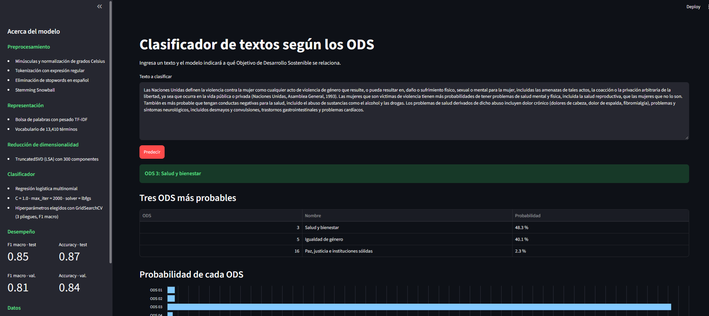
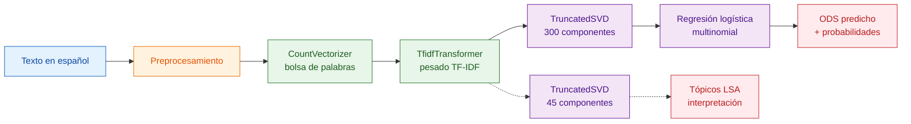
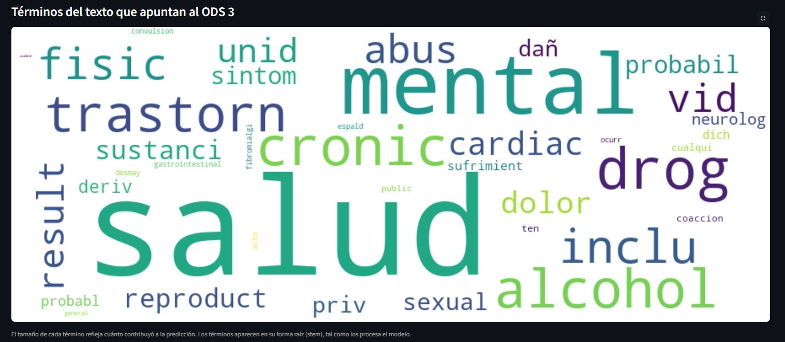

# Clasificador de textos según los ODS

Clasificación automática de textos en español según los 17 Objetivos de Desarrollo Sostenible (ODS) de la Agenda 2030, con procesamiento de lenguaje natural, reducción de dimensionalidad y una aplicación web para consultar el modelo.



**Aplicación en línea:** https://uniandes-maia-mlns-imgclass-202524485-202613383.streamlit.app/


## Descripción

El proyecto parte del conjunto de datos OSDG Community Dataset (versión 2023), con 9.656 textos en español etiquetados con un ODS. El ODS 17 no aparece en los datos, por lo que el modelo clasifica entre 16 clases.

El notebook `Notebook_micro_proyecto_2.ipynb` contiene todo el proceso: limpieza, división de datos, construcción del pipeline de texto, análisis de tópicos con LSA, búsqueda de hiperparámetros del clasificador y evaluación sobre textos no vistos. La aplicación `streamlit_app.py` carga el pipeline y el modelo entrenados y permite clasificar textos nuevos.

## Cómo funciona el pipeline



**Preprocesamiento.** Conversión a minúsculas, normalización de grados Celsius a un token único, tokenización con la expresión regular `[a-záéíóúüñ][a-záéíóúüñ0-9]+`, eliminación de stopwords en español y stemming Snowball. El patrón de tokenización descarta números sueltos y caracteres mal codificados presentes en el dataset, pero conserva términos con dígitos como `co2`, `km2` o `kwh`.

**Representación.** Bolsa de palabras con pesado TF-IDF sobre un vocabulario de 13.410 términos, ajustada solo con el conjunto de entrenamiento.

**Reducción de dimensionalidad.** TruncatedSVD (LSA). Se usan 45 componentes para interpretar tópicos y 300 componentes como entrada del clasificador, valor elegido por búsqueda de hiperparámetros.

**Clasificador.** Regresión logística multinomial. Los hiperparámetros se eligieron con GridSearchCV, validación cruzada de 3 pliegues y F1 macro como métrica, por el desbalance entre clases.

## Resultados

Los datos se dividieron de forma estratificada en 60 % entrenamiento, 20 % validación y 20 % test. El conjunto de test no participó en ningún ajuste ni decisión.

| Conjunto | F1 macro | Accuracy |
|---|---|---|
| Validación cruzada (train) | 0.82 | – |
| Validación | 0.81 | 0.84 |
| Test | 0.85 | 0.87 |

Efecto del número de componentes del SVD en la búsqueda de hiperparámetros (F1 macro, validación cruzada):

| Componentes | 15 | 20 | 45 | 100 | 200 | 300 |
|---|---|---|---|---|---|---|
| F1 macro | 0.59 | 0.68 | 0.78 | 0.80 | 0.82 | 0.82 |

F1 por clase en el conjunto de test:

| ODS | F1 | ODS | F1 |
|---|---|---|---|
| 1 Fin de la pobreza | 0.83 | 9 Industria e innovación | 0.72 |
| 2 Hambre cero | 0.84 | 10 Reducción de desigualdades | 0.63 |
| 3 Salud y bienestar | 0.89 | 11 Ciudades sostenibles | 0.82 |
| 4 Educación de calidad | 0.93 | 12 Producción y consumo responsables | 0.87 |
| 5 Igualdad de género | 0.91 | 13 Acción por el clima | 0.88 |
| 6 Agua limpia y saneamiento | 0.89 | 14 Vida submarina | 0.89 |
| 7 Energía asequible | 0.91 | 15 Vida de ecosistemas terrestres | 0.89 |
| 8 Trabajo decente | 0.68 | 16 Paz, justicia e instituciones | 0.92 |

Los ODS 8, 9 y 10 son los que más se confunden entre sí, por compartir vocabulario económico.

## Instalación y uso

Requiere Python 3.11.

```bash
git clone https://github.com/rfonsecad/ML-analisis-texto-y-reduccion-dimensionalidad.git
cd ML-analisis-texto-y-reduccion-dimensionalidad
pip install -r requirements.txt
streamlit run streamlit_app.py
```

La aplicación se abre en `http://localhost:8501`. Escribe un texto, pulsa **Predecir** y obtendrás el ODS asignado, las probabilidades de las 16 clases y los términos del texto que más pesaron en la decisión.



Para reentrenar el modelo, ejecuta el notebook completo. Al hacerlo se regeneran los archivos `pipeline_tfidf.joblib` y `modelo_ods.joblib` en `resources/models`, que son los que carga la aplicación.

## Estructura del proyecto

```
.
├── Notebook_micro_proyecto_2.ipynb   Análisis, entrenamiento y evaluación
├── streamlit_app.py                  Aplicación web
├── 8_Datos_textosODS.csv             Datos de entrenamiento
├── requirements.txt                  Dependencias con versiones fijadas
└── resources/
    ├── models/                       Pipeline TF-IDF y modelo entrenado (joblib)
    ├── img/                          Capturas de la aplicación
    └── batch/streamlit.bat           Lanzador de la aplicación en Windows
```
